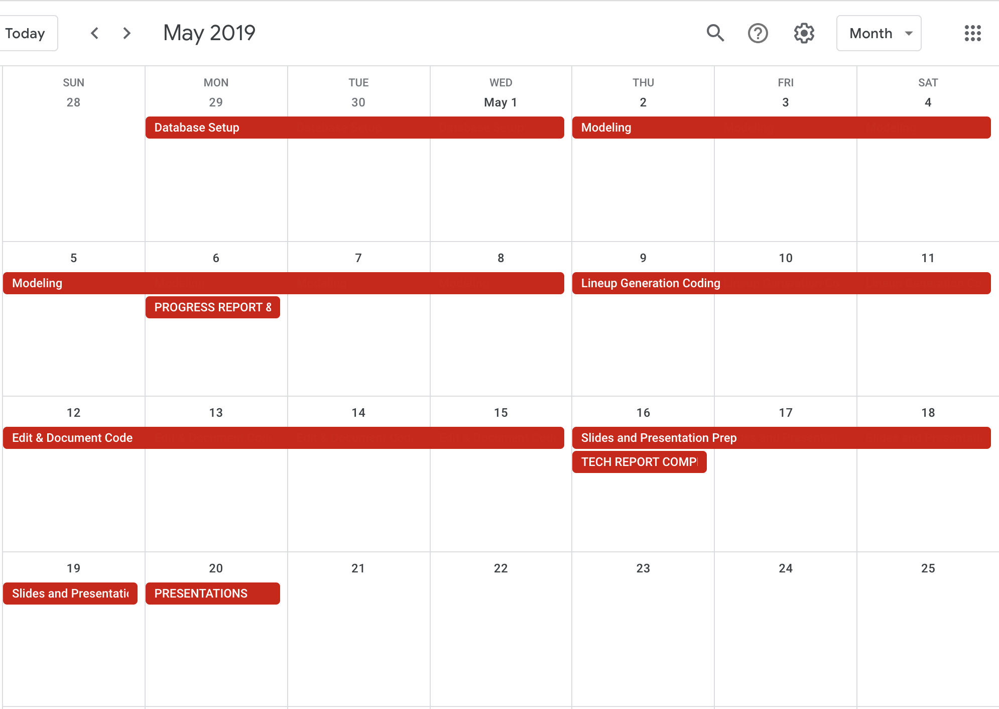

## Capstone Check-in 3
---
### Do you have data fully in hand and if not, what blockers are you facing?
I have enough data in hand to complete the capstone but I might seek additional data in the next couple of weeks.

### Have you done a full EDA on all of your data?
I’m in the process of assembling my raw data into usable dataframes for modeling.

### Have you begun the modeling process? How accurate are your predictions so far?
I have not started modeling yet.

### What blockers are you facing, including processing power, data acquisition, modeling difficulties, data cleaning, etc.? How can we help you overcome those challenges?
The biggest hurdle so far has been conceptualizing how best to arrange the data for time-series modeling. I think I have a handle on it but I will reach out to Wes if it’s not going well.

### Have you changed topics since your lightning talk? Since you submitted your Problem Statement and EDA? If so, do you have the necessary data in hand (and the requisite EDA completed) to continue moving forward?
My topic has changed since the beginning of capstone but not since our last 1:1. Instead of building a lineup generator for daily fantasy baseball I am building a daily hit predictor that determines the probability that players will record a hit in their next game. I believe I have adequate data to complete an acceptable version of this project. But depending on how well and how quickly modeling goes, I might seek additional data.

### What is your timeline for the next week and a half? What do you have to get done versus what would you like to get done?

### What topics do you want to discuss during your 1:1?
I’d like to confirm that I’m on the right track with my data frame assembly.